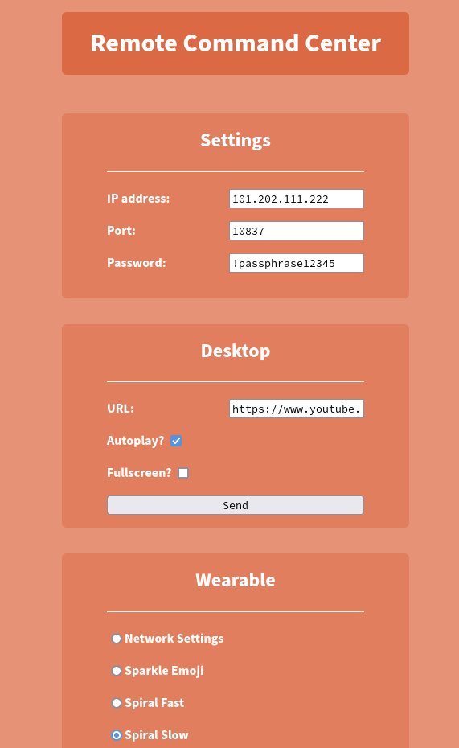

# Remote Control Tool
*as mentioned on twitter, and all that.*

## Overview

The tool is comprised of a client that sends commands to a server listening for input.
In a broad sense, this looks like:
```
client ---(command)---> server
```
where the command would be something like opening a specific URL in the browser.

The current functionality of the server is to:
* open URLs, including autoplay and fullscreening them
* manage other devices, such as the [hypnocollar - wearable device with a screen I’ve also been working on](https://github.com/pridebeef/smart-wearable)
  * The “wearable” is the project mentioned there, which will have more build logs eventually, but should be enough to DIY already!

## Warning / Notice

I tried to make this as secure as possible, reading what I could find on proper practices for TLS, but
given the nature of the tool, there could definitely be the potential for arbitrary/remote code execution issues.
**I do not have much experience with many of these protocols and tried my best, but flaws definitely exist.
Be careful about running this, and if you notice something, let me know!**

## Screenshot



- - -

## The Client

The client is run from a local web app, as I figured that was a bit cleaner and more usable
than using scripts with a ton of arguments.

The client looks like this:

<screenshot here>

and is a form that sends all those arguments to a backend which opens a socket to the server to send the commands.

### Client Setup

#### Prerequisites

The client requires `python` (anything 3.X should work) and `flask`, which can be installed with `pip install flask`

#### Configuration

`modes.json` - named modes for the smart wearable. Examples are provided.

### Usage

`python client.py` and then opening a browser to `http://127.0.0.1:5000`, the default flask server.

Note: (`http` rather than `https` should be fine for the local web app, 
because the client web app POSTs to localhost, which would not be visible to the network -
anything going to the network and the server machine is from the webapp’s backend through TLS.) 

- - -

## The Server

The server is a bit more involved, as it handles opening programs on the machine and all of the necessary security. 

### Server Setup

#### Prerequisites

The server requires `python` and the `selenium` package, as well as `chromedriver` and `chrome`/`chromium` on the machine.
Firefox support may exist later, but the options for fullscreen have only been set up for Chrome.
An SSL certificate is required: a self-signed certificate that the config can be pointed to suffices.
`openssl req -new -x509 -key key.key -out cert.crt -days 360` with proper permissions is what I used.
I’m not sure what would do this on Windows, but I bet it exists.

#### Configuration

`server_config.json` - the server settings. All of the settings are listed with default values, but should be changed to
fit your setup. All of these are required, but platform-specific settings will be ignored on other platforms.

* `host`: the address to host on. `0.0.0.0` would be a public-facing server.
* `port`: the port to bind to.
* `password`: a shared key for the client and server to agree on, transmitted through TLS. 
* `ssl`:
  * `cert`: path to SSL certificate - see above section.
  * `key`: path to SSL key - see above section.
* `paths`:
  * `windows`/`linux` - OS specific settings.
    * `browser` - path to browser executable to be used
    * `driver` - path to selenium chromedriver executable to be used
* `wearable`:
  * `ip`, `port` - network settings for the smart wearable on the local network

### Usage

`python server.py` and wait for someone with the client to mess with you.
